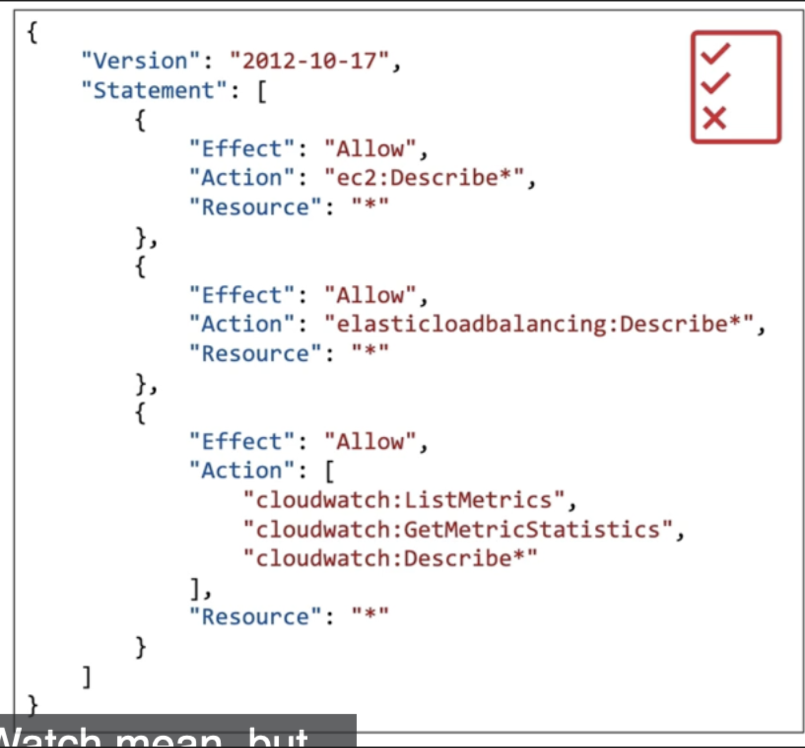

- IAM stands for identity and access management
	- Global service
- After setting up a root account, we should create users and then use those accounts
- Users are people within an org

## Groups
- Can be grouped based on role
	- Groups cannot be nested- cannot contain groups
	- Best practice is to have each user assigned to a group
	- Groups can also overlap
- IAM policies
	- Formatted as JSON documents
	- Applies to all users in a group:
	  
- Utilize principle of least privilege