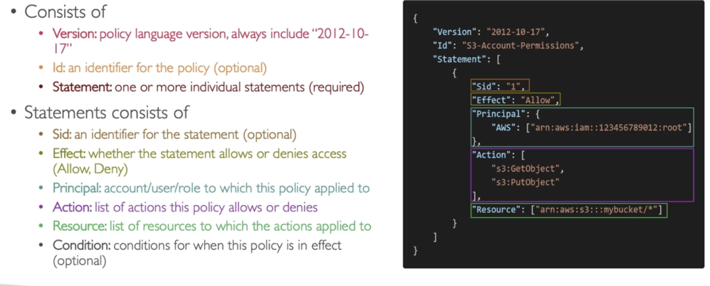

- Policies attached at group level are inherited by all members of the group
- Users can belong to multiple groups

## Policies Structure
- Formatted as JSON containing the following info
	- Version- Contains version number
	- Id- an unique ID for policies (optional)
	- Statement- array of statements
		- Sid- unique ID (optional)
		- Effect- Allow or Deny
		- Principal- account/user/role that the policy is applied to
		- Action- list of actions allowed or denied by policy
		- Resource- list of resources the action is applied to
		- Condition- condition for when this policy is active (optional)
