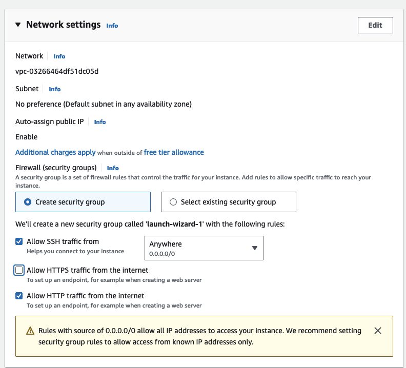

- Go to EC2 -> Launch Instance
- Can add multiple tags to instance, but one tag must be name
- Choose base image for EC2 instance
	- Can search from full catalog, or choose quickstart one
	- Amazon has their own Linux distro we will use
	- Called AMI (Amazon machine image)
- Instance type control # CPU, memory, etc.
- Create a new SSH keypair to login to instance
- Network settings
	- instance will get public IP by default
	- Creates new security group that allows SSH traffic from anywhere
	- Also check box to allow HTTP traffic
	  
- Leave storage at default
	- EBS storage will be deleted at instance termination
- Advanced config
	- Can change many different options
	- At bottom, is the user data, which is the bootstrap script that will run when instance starts
	- Paste this code into user data:
```bash
#!/bin/bash

# Use this for your user data (script from top to bottom)

# install httpd (Linux 2 version)

yum update -y

yum install -y httpd

systemctl start httpd

systemctl enable httpd

echo "<h1>Hello World from $(hostname -f)</h1>" > /var/www/html/index.html
```
- Each instance gets an ID
- Has a public IPv4 address
- Has a private IPv4 address and DNS name that can be used on AWS network
- Instances can be stopped and started at anytime
	- When an instance is stopped, you do not get billed for it
- The public IP address might change if you stop and restart the instance
	- Private IP address will never change
- 