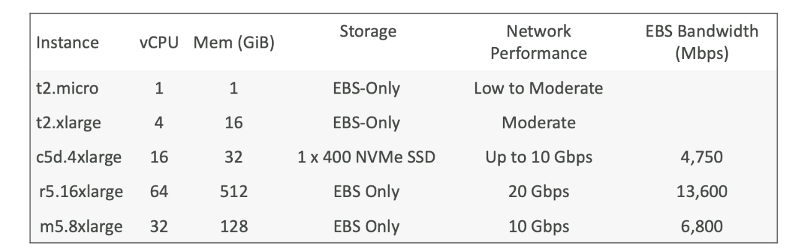

- several types of instances
	- General purpose
	- Compute optimized
	- Memory optimized
	- accelerated optimized
	- storage optimized
	- HPC optimied
	- 
- Naming convention: m5.2xlarge
	- m- instance class
	- 5- generation (AWS increments this over time)
	- 2xlarge- size of instance types
- Instance types description
	- General purpose
		- good balance of compute, memory, networking
		- good for web servers or code repos
		- t2.micro is what we'll use, which is a general purpose instance
	- Compute optmized
		- Great for compute instensive tasks- i.e., batch processing workloads, media transcoding, high performance web server, high performance computing
		- Name starts with `c`
	- Memory optimized
		- Useful for memory instensive tasks- e.g., databases, web scale caches, in memory database, real time processing of large datasets
		- name starts r/x/z
	- Storage optimized
		- Good for tasks that require high I/O speeds and access to large datasets, like high frequency online transaction processing
		- name starts with I/D/H
- Instance type comparison
  
- Useful website to compare instances- https://instances.vantage.sh/