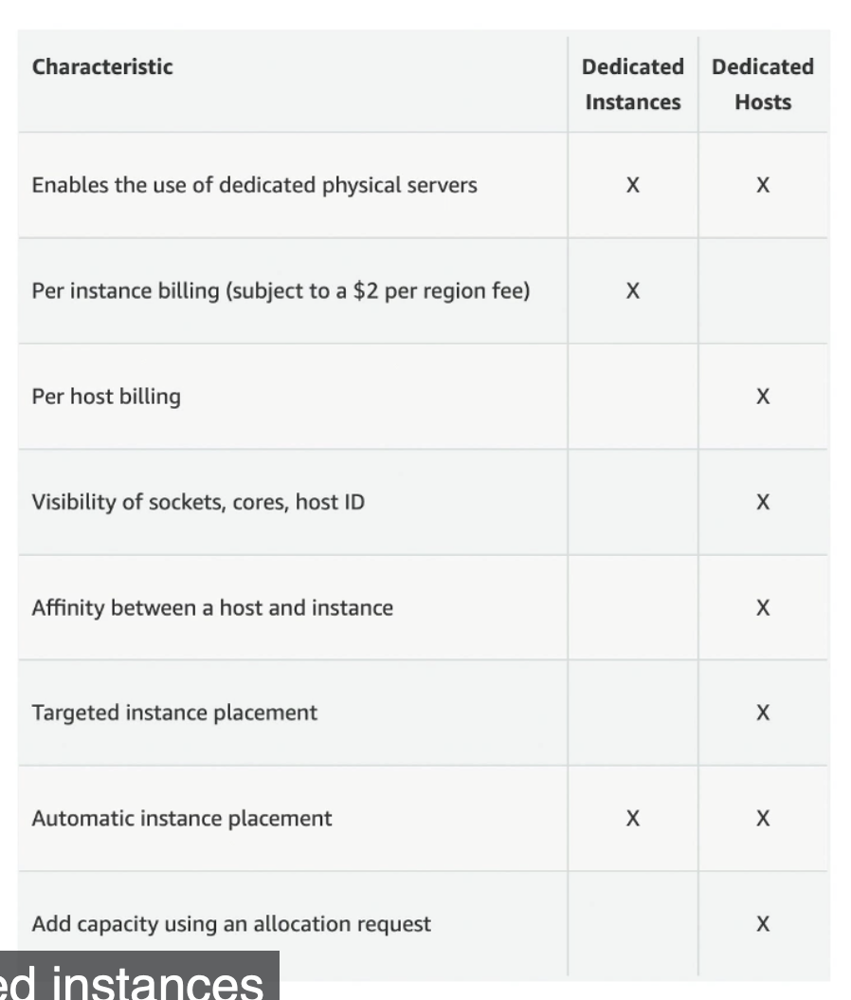
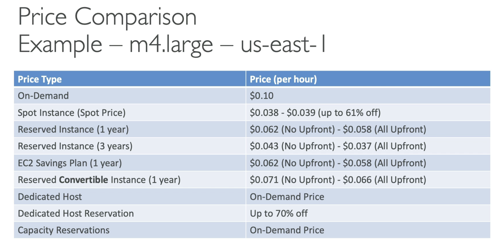
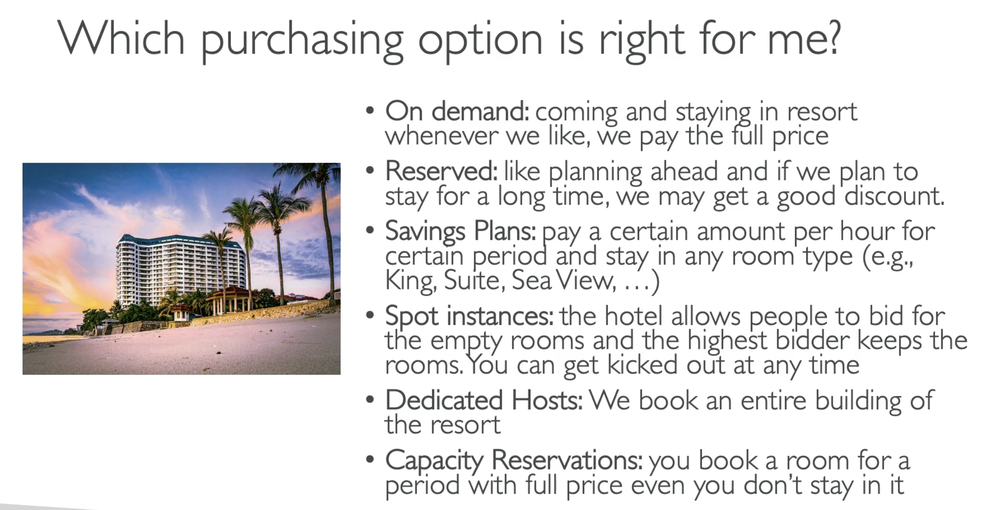

- On demand
	- short workloads
	- pay by second
- Reserved (1 or 3 years)
	- good for long workloads
	- convertible- long workloads with flexible instances
- savings plan (1 or 3 years)
	- commitment to a set amount of usage
	- long workoads
- Spot instances
	- short, interruptible workloads
	- Can lose instance at any time
- dedicated hosts
	- Reserve an entire physical server
- dedicated instance
	- no other customer will share hardware
- capacity reservation
	- reserve capacity in specific AZ for specific data/time/duration

## EC2 On Demand
- Pay for what you use
	- Linux/Windows- pay per second
	- All other OS- pay per hour
- Highest cost, but no upfront payment
- no long term commitment
- Good for short term, uninterrupted workloads

## EC2 Reserved Instances
- Up to 72% discount compared to on demand
- Reserve specific instance attributes (instance type, region, OS)
- Payment options (from least to greatest discount)
	- No upfront
	- Partial upfront
	- All upfront
- Can set scope to regional or zonal (reserve capacity in specific AZ)
- Useful for long running, stead applications
- can buy and sell in reserved instance marketplace

- Convertible reserved instance- convert to other types, like instance type, family, OS, scope, etc.
	- Up to 66% discount

## EC2 Savings Plan
- Get a discount based on long term usage (up to 72%)
- Commit to certain type of usage (i.e., $10 / hour for 1 or 3 years)
- Usage beyond savings plan is billed at on-demand price
- Locked to specific instance family and AWS region
- Flexible across instance size, OS, tenancy

## EC2 Spot Instances
- Up tp 90% discount
- You define the max price you want to pay- can lose instance at any time because you 
- Most cost-efficient instance in AWS
- Good for batch jobs, data analysis, distributed workloads, etc.
- Not suitable for critical jobs

## EC2 Dedicated Hosts
- Physical server with EC2 instances fully dedicated to your use
- Useful for meeting compliance requirements or using existing server-bound software licenses
- Purchase on-demand or reserved
- Most expensive option
- Can pay per second or reserve for 1 or 3 years
- Good for strong regulatory or compliance needs

## EC2 Dedicated Instances
- Instance run on hardware dedicated to you
- Hardware may be shared with other instances in **same account**
- No control over instance placement
- Similar to dedicated hosts, but this has multiple instances on one host
  
  - Dedicated hosts allows access to physical host itself and low level hardware

## EC2 Capacity Reservations
- Reserve on demand instances capacity in a specific AZ for any duration
- No time commitment, no billing discount
- Charged at on-demand rates, even if you don't run instances
- Good for short-term, uninterruptible workloads

## Choosing the best options

Resort comparison: 
