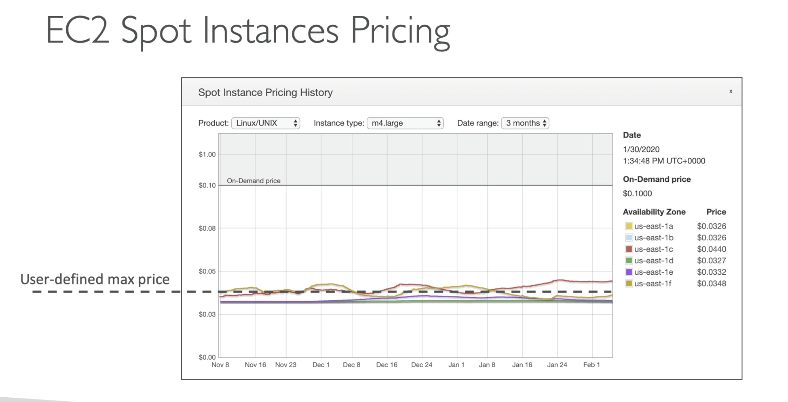

- Up to 90% discount compared to on-demand
- Define max price to pay, and get the instance while the spot price is less than that max
- If current spot price goes over max, then stop/terminate instance within a 2 minute grace period
- Spot block- block a spot instance for a specified time frame
	- No longer available in AWS as of 2022/12/31
- Useful for batch jobs, data analysis
- Spot instance pricing compared to on demand: 

## Spot Instance Termination
- Spot request- define how many instances, max price, launch spec, one-time or repeated, valid from and until
- Spot request will re-launch spot instances if they get stopped and spot request is still valid
- Cancelling a spot request does not terminate instances; you will still need to terminate them **after** terminating the spot request
	- If you terminate the instances first, the spot request will spin the instances back up per the spot request spec

## Spot Fleet
- Spot fleet = set of spot instance + (optional) on-demand instances
- Try to meet capacity target with price constraints
	- Define possible launch pools (instance type, OS, AZ, etc.)
	- Spot fleets stop launching instances once they reach capacity or max cost
- Allocation strategies
	- lower price- pick from pool w/ lowest price
	- diversified- distributed across pools
	- capacity optimized- pool with optimal capacity
	- price capacity optimized- pick from pool with highest capacity, then select with lowest price
- Spot fleets allow user to auto request spot instances w/ lowest price