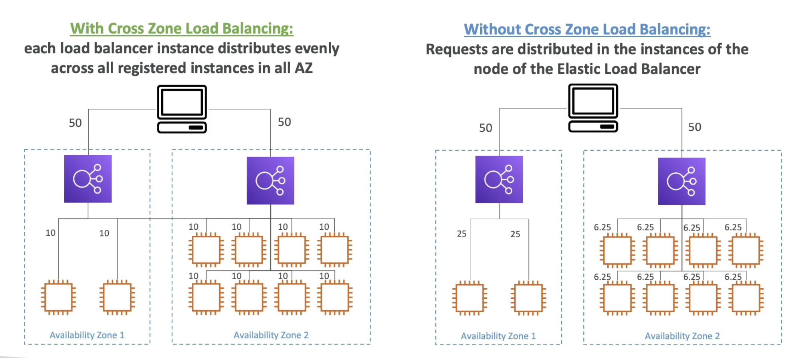

# 79- Cross Zone Load Balancing
- Scenario- we have two AZ
	- First AZ has 2 EC2 instances
	- Second AZ has 8 EC2 instances
- Auto cross zone load balancing is available
	- So traffic will be split between all registered EC2 instances, regardless of AZ
- Without cross zone load balancing, traffic is split 50/50 between each LB and EC2 instances in AZ1 receive much more traffic 

- Varies depending on LB type
	- Enabled by default for ALB, but can be disabled at target group level
		- no charge for cross AZ data
	- Disabled by default for NLB and GLB
		- charges are incurred here for cross AZ data
	- Disabled for CLB
		- No charge for cross AZ data
-  