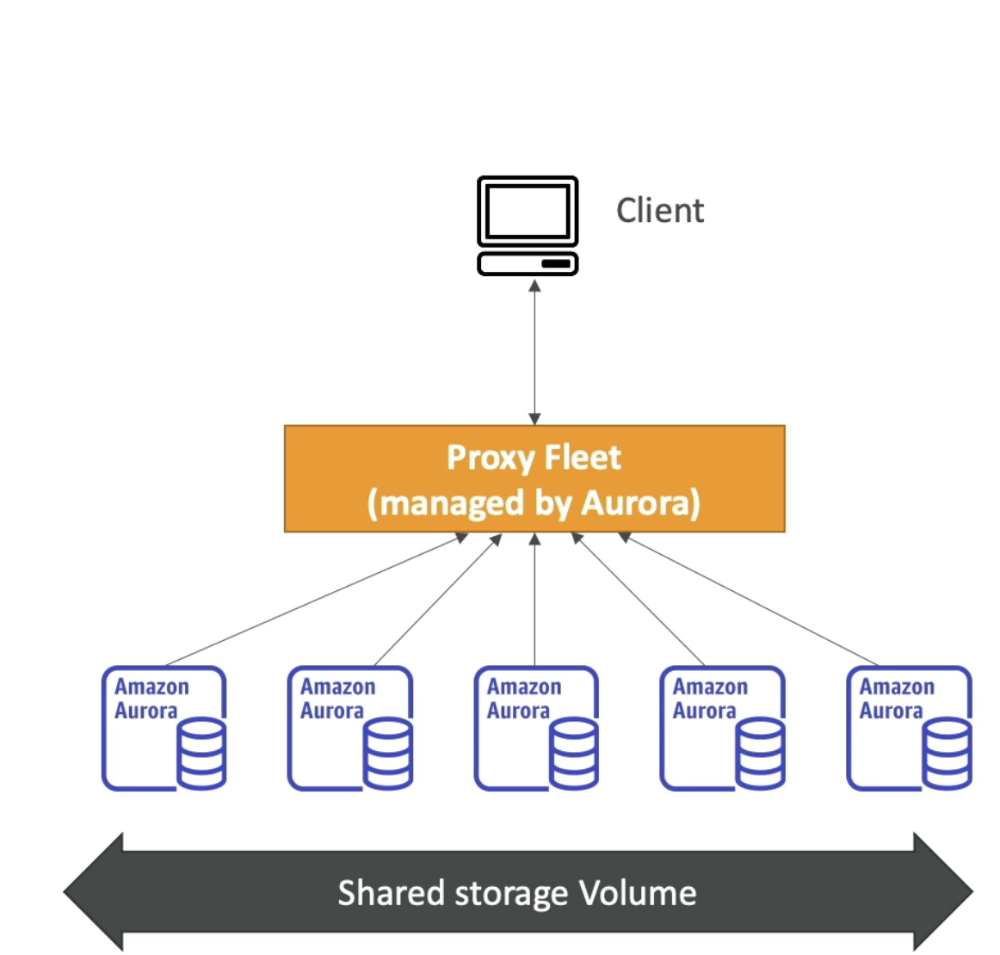
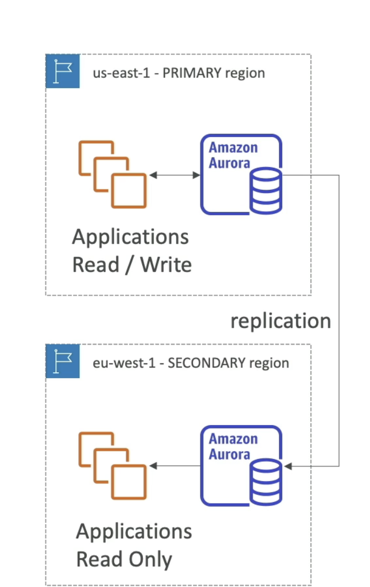
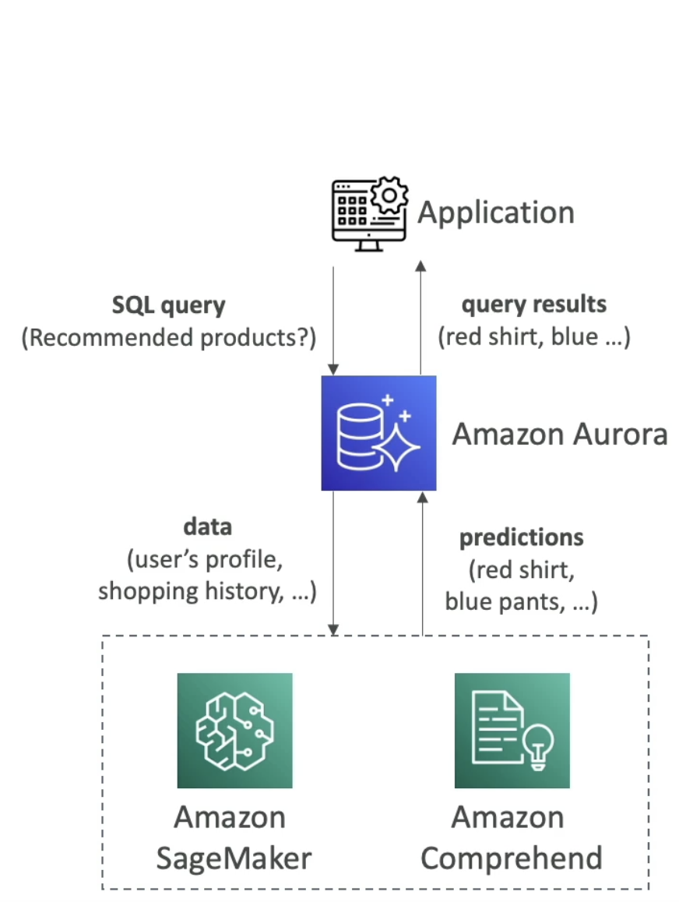

# 93- Amazon Aurora Advanced Concepts
## Replicas and Auto Scaling
- If we have many requests on reader endpoint, we can autoscale based on CPI usage
	- Reader endpoint then begins to load balance across newly created replicas
### Custom Endpoints
- We could also have two different kinds of replicas
- We can then define a subset of the Aurora instances as custom endpoint
	- These more powerful instances could server bigger/analytical endpoints
- Generally, reader endpoint is not used after defining custom endpoints
	- We would set up multiple custom endpoints depending on workloads

## Aurora Serverless
- Automated databased isntantiation and auto0scaling based on actual usage
- Good for unpredictable workloads
- no capacity planning
- Pay per second- more cost-effective
- Client talks to proxy fleet (managed by Amazon)
  

## Global Aurora
- two options for cross region
	- Aurora cross region read replicas
		- useful for disaster recovery
		- Simple to set up
	- Aurora Global database (recommended)
		- 1 primary region with RW capabilties
		- Up to 5 secondary RO regions (replication lag <1 second)
		- Up to 16 read replicas per secondary region
		- Low latency
		- Promoting another region to primary for DR takes <1 minute
		- Cross-region replication takes < 1 second

## Aurora Machine Learning
- Add ML based predictions to app via SQL
- Simple, optimized, and secure integration between Aurora and ML services
- Support AWS SageMaker and AWS Comprehend
- Use cases- fraud detection, targeted ads, etc.

