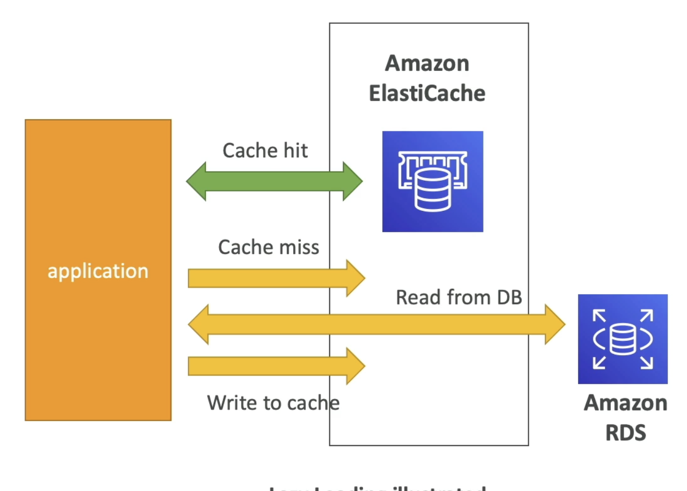
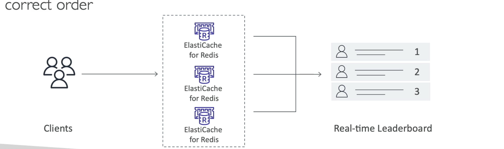

# 99- ElastiCache for Solutions Architect
- Support IAM auth for Redis only
- IAM policies on ElastiCache are only used for AWS API-level security
- Redis Auth
	- Set password/token when create cluster
	- extra layer of security on top of security groups
	- Supports in-flight encryption via SSL
- Memcached
	- Supports SASL-based Auth

## Patterns for ElastiCache
- Lazy loading- all read data is cached, data can become stale
- Write through- adds/updates data in cache when written to DB (no stale data)
- Session store- store temporary session data in cache
- Caching is difficult

Lazy loading:  

## ElastiCache- Redis Use Case
- Gaming leaderboard
- Redis sorted sets- guarantees uniqueness and element ordering
- Newly added elements are ranked in real time and added to correct order

